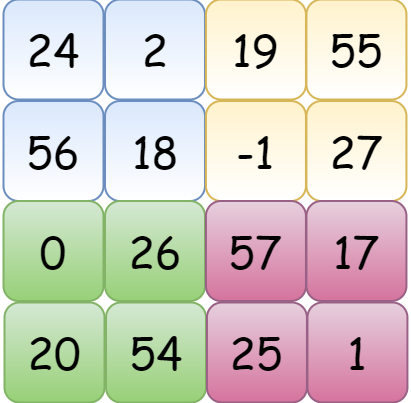
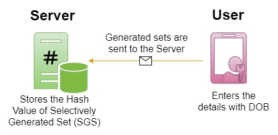
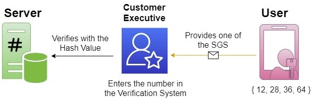

# Magic Square Birthday Anonymizer and ZKP Verifier    

Birthday Anonymizer and Zero Knowledge Verifier based on Ramanujan's Magic Square

# Problem Statement

**Date of Birth (DOB)** is one important identity and documentary proof that is widely used and accepted by various government and private organizations. **Birth Certificate** is a documentary proof that we submit whenever we need to prove our identity and age to avail services from Government or non-governmental organization.  Most common use where most of us are requested for date of birth :date: is during a verification call :telephone_receiver: from customer care :information_desk_person: from banks :bank:, for example say to verify your identity to issue a credit card :credit_card:. 

The Vishing attacks (Phishing through voice calls) are increasing where the attacker or malicious person tries to get the date of birth :date: and OTP :vibration_mode: to steal money from our account by portraying as authorities from financial institutions. 

# Zero Knowledge Proof (ZKP)

A **zero-knowledge proof or zero-knowledge protocol (zkp)** is a method by which **the prover** can prove to **the verifier** that they know a value **x**, without conveying any information apart from the fact that they know the value x. The essence of zero-knowledge proofs is that it is trivial to prove that one possesses knowledge of certain information by simply revealing it; the challenge is to prove such possession without revealing the information itself or any additional information.

Interactive zero-knowledge proofs require interaction between the individual (or computer system) proving their knowledge and the individual validating the proof. Some forms of non-interactive zero-knowledge proofs exist, but the validity of the proof relies on computational assumptions (ideal cryptographic hash function).

# Magic Square

**Magic Square** is any square array of numbers,  if the sums of the numbers in *each row*, *each column*, and both *main diagonals* is a constant (referred as **magic constant**). The magic square can be of any order (n) from 3. The popular game **Sudoku** is a magic square of order 9, with multiple smaller magic squares of order 3. There are different variations of magic square created as on date. Shown below is an example magic square of order 3 with magic constant 15.

   | 4 | 9 | 2 |
   |---|---|---|
   | 3 | 5 | 7 |
   | 8  | 1 | 6 |

# Ramanujan's Birthday Magic Square

**Srinivasa Ramanujan**, one of the greatest mathematician of all time has constructed a below magic square based on Birthday. This magic square is of order 4. 

   | DD | MM | yy | YY | 
   |---|---|---|---|
   | YY+1 | yy-1 | MM-3 | DD+3 | 
   | MM-2 | DD+2 | YY+2 | yy-2 |
   | yy+1 | YY-1 | DD+1 | MM-1 |

   Example with a date :date: : 24-02-1955 (Steve Paul Jobs)

   <p align="center">
   
   </p>  

   :dart: **Magic Constant : 100**
   
# Anonymizer and ZKP Verifier   
   
  Proposing to use the Ramanujan's Magic Square to create a system that anonymizes the Birth Date before storing in the Database of Service Provider and use a Zero Knowledge Proof Verifier to verify as and when needed. 
  
  - **Generation** 
  
    - Assume _Mr. Steve Paul Jobs_ wishes to register with a service provider. The said service provider has the proposed Anonymizer and ZKP Verifier. So during registration         once he enters the DOB and registers. The magic square is created (as shown above).

<p align="center">

</p>  

   - We now, generate different combinations that can generate the magic constant (i.e., 100) as seen below. We get 15 different sets (4 Rows, 4 Columns, 2 Main Diagonals, 5      Squares) from this the user selects 'n' sets which is stored in the application server for later verification which is referred as "Selectively Generated Sets (SGS)".
   
      ```
      [1]  => { 24, 2, 19, 55 }
      [2]  => { 56, 18, -1, 27 }
      [3]  => { 0, 26, 57, 17 }
      [4]  => { 20, 54, 25, 1 }
      [5]  => { 24, 56, 0, 20 }
      [6]  => { 2, 18, 26, 54 }
      [7]  => { 19, -1, 57, 25 }
      [8]  => { 55, 27, 17, 1 }
      [9]  => { 24, 18, 57, 1 }
      [10] => { 20, 26, -1, 55 } 
      [11] => { 24, 2, 56, 18 }
      [12] => { 19, 55, -1, 27 }
      [13] => { 0, 26, 20, 54 }
      [14] => { 57, 17, 25, 1 }
      [15] => { 18, -1, 26, 57 }
      ```

   - In real case, most of the DOB are publicly available as part of Social Media Profiles and friends & family knowing this information. We propose to use additional              :secret: to generate a modified birthday magic square with same properties. 

      Birthday Magic Square with :secret: 10
    
      | 34 | 12 | 29 | 65 | 
      |---|---|---|---|
      | 66 | 28 | 9 | 37 | 
      | 10 | 36 | 67 | 27 |
      | 30 | 64 | 35 | 11 |

       :dart: **Magic Constant : 140**
      ```
      [1]  => { 34, 12, 29, 65 }
      [2]  => { 66, 28, 9, 37 }
      [3]  => { 10, 36, 67, 27 }
      [4]  => { 30, 64, 35, 11 }
      [5]  => { 34, 66, 10, 30 }
      [6]  => { 12, 28, 36, 64 }
      [7]  => { 29, 9, 67, 35 }
      [8]  => { 65, 37, 27, 11 }
      [9]  => { 34, 28, 67, 11 }
      [10] => { 30, 36, 9, 65 }
      [11] => { 34, 12, 66, 28 }
      [12] => { 29, 65, 9, 37 }
      [13] => { 10, 36, 30, 64 }
      [14] => { 67, 27, 35, 11 }
      [15] => { 28, 9, 36, 67 }
      ```
   - To provide security and privacy these values are not stored as such, but the cryptographic hash values are stored. Below we have used the :hash: SHA3-512 algorithm.
    
       ```
      [1]  => fa8a3c803410335e92daa008418a37c71591f9eb04010b32e0d7dffabb416eebc635dada0fe21669db27337e9735da94bb138c2e59cb966ca2e5cefed4a7713b
      [2]  => 3e05042633ed174df089a4e25d2ccd07c682459cdff5d36f4454dbbac0a4a77c1b186a4321d43deacc2bdc9a400f564128c745a4d970929a9a29b74e8b6ec6bd
      [3]  => c572f64d842820f082f2f40f325d559c3404897fcc2d29968fe00f9dcbb218a0c0265d98fb58c6a04aea7df19707d187de19b68551cd1aca55ebc7c366bcac92
      [4]  => 4067da838aa2108ee7583d0c5f0ec57840072651df423cec9959b011bc42b30144b9162b1e9a388a4314ad763ea06bec61879827b326736e67b495c80fea088a
      [5]  => 45c79047d7dbbbda37e10c68e0bebfbcf823994bc67b33c792ae731387ade550128f60f89832d8b2f1a215bf2f3dadf8d3c524c745f044487032357f4faeee88
      [6]  => cef6b11463f07ec3de0dd12a08c182813ab882313528309ab63eeffecb40a8706baec4031af9d670e6e2ba4a12e218935c7a623d715116fa31692b1385841803
      [7]  => 53c24b8549945d483de1cae7e5fa8fc985ea223a09253e0b86476b371407d5f315eef52ef77fbeec2a73d16468a30bf28a3d851d903a946a73bcda6f0779c7e7
      [8]  => dad99da2f6d34a3a343ef7675799ff39d24afdfc2d68a3aa0e9a5fb1cc20d1b8396febdb03387462367c3993a947eb77382f3f29a3da76dbad162709ba598be5
      [9]  => 90f1f06d8056cd73195b5d254e8e7e982cb018941e251dbde6519a4151348081ff6cc5d72443d34e194f659d7044588f342a9af06927ee2ca28b1d72ec29acc2
      [10] => 549ab298b31dd2e700567817a9c6f462ac2faae9b5ba1ca4293981c7a65718e1d8b6128aa3c226394c286543e3a6bc0e018f791cbb563ce393066bc682f289b5
      [11] => 9a1a7927e863701706dcf435d29bc21c19a2208fc8c0a53d6859e38e256741973994832401f24bb0889a347ada42d88900f209f55a6f8274f21b56e0d135fe2a
      [12] => 8a4a6f43bbced039111a8b9c9a47eb7417a2b49de80fe7d985f41044e99869e7188ffd12d41f35998ee55031cbe28f3df71c5430aa1db34b52e3e49d1eb5bf92
      [13] => f512272e68b9fdd0520f50a1f808b804591cc93e6713ca6f1b027e27b4e6ade0f65cb905a127e7f63b661a7587d57d552baef8e2d95b1cc105cbf87d064cdb0f
      [14] => 5b632aa524c30c2590e24a50d4907a573fd1c87c6b624ffb6011a4f75514e6dd5d8630f6671ebdf8c6ebdddbfb06f5fbff9e920eea1918d2990dc73157f764cd
      [15] => 2fc6903f567c4a838cb36a4190039ac60d4e538f43edc9ee4e8e39804167e49bbdec87ddcc1087f63777b961adfc141ad3b1a3cabd1543f0caedb266f3921f56
      ```
      
  - **Verification**
  
      - Now when Mr. Steve Paul Jobs is requested for date of birth :date: during any verification call :telephone_receiver: from customer care :information_desk_person:, he         can just issue one of these numbers, without actually revealing the date of birth, now he can be verified. 

   <p align="center">
   
   </p>  

# Threat Model and Actors

  - Any unknown third party malicious actors who randomly performs vishing attack on potential targets to reveal details for personal gains.
  - Any known malicious actors who targets for personal gains. 

# Conclusion
   In this proposed Birthday Anonymizer, we anonymize the given Birthday with the use of Ramanujan's Birthday Magic Square with additional secret value. We have created a ZKP based verifier which verifies the date of birth by revealing only the Selectively Generated Sets (SGS) which is stored in the service provider application server/database. This ensures that no customer executive or third party can gain knowledge of the user's actual DOB. 
   After the implementation of this system, the user when using only the service provider (web/mobile) applications to avail services directly can use the DOB in the field provided. If the user is contacted for any service activation or customer executive for any authentication then share any set from the SGS to any external third-party.
   
# Implementation
   In the actual system of implementation,
   - the Magic Square can be randomized in numerous other ways.
   - the pattern can be customized (to complicate) for generating the hash values (say { 12, 28, 36, 64 } or [ 12, 28, 36, 64 ] or any pattern)
   - the number of sets if required can also be increased by taking different combinations from the basic 15 sets from the magic square (ensuring only that these numbers add      to the magic constant). 
   - Even if there are 100s of sets generated, only selected sets are stored in the application server for later verification.
   - The service provider can allow the users to update this secret and regenerate the new magic square and SGS periodically. 

# References 

  - Magic Square and Ramanujan's Birthday Magic Square. Wikipedia. https://en.wikipedia.org/wiki/Magic_square
  - Feige, U., Fiat, A. & Shamir, A. Zero-knowledge proofs of identity. J. Cryptology 1, 77–94 (1988). https://doi.org/10.1007/BF02351717
  
# Cite as
Ramaguru R. Birthday Anonymizer and Zero Knowledge Verifier based on Ramanujan's Magic Square. NamChain Open Initiative Research Lab. Feb 24, 2021. https://namchain-open-initiative-research-lab.github.io/Birthday-Anonymizer-ZKP-Verifier/
